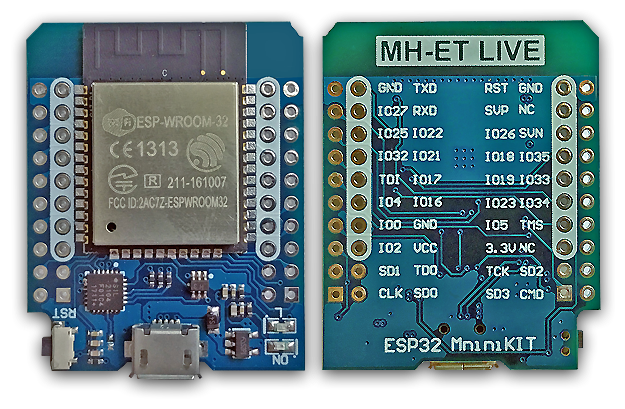
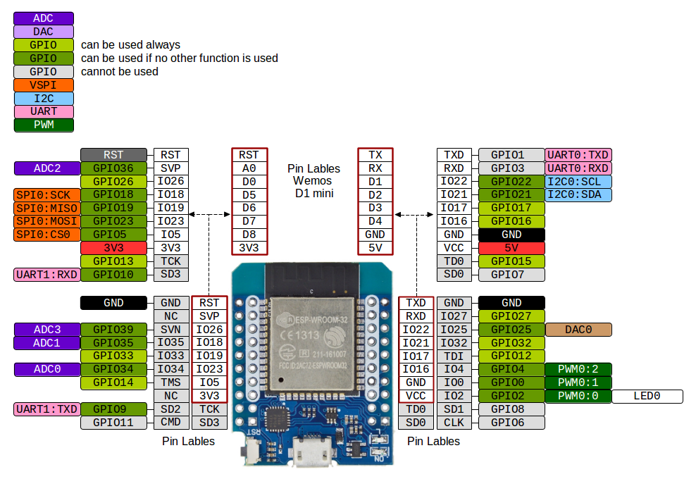

# Introduction

This is a collection of some practical examples of the ESP32 running on the ESP-IDF environment. 
Different sensors are used with various interfaces towards the ESP32.
 
## Development Board

MH ETLive ESP32 Mini kit is used through out. It has ESP32S SoC as main microcontroller. 
Below is the image of the board.

Here is the pinout diagram of the Mini kit 

## Getting Started 

Go to the test1 project's readme file. 
It explains each single steps and prerequisties to start the first ESP-IDF application. 
